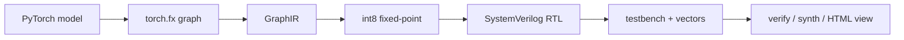

# torch2rtl


`torch2rtl` превращает маленькие PyTorch-модели в понятный fixed-point
SystemVerilog. Не в стиле "нажали кнопку и получили магию", а честно: модель
разбирается через `torch.fx`, переводится во внутренний IR, квантуется, затем
генерируются RTL, testbench, проверочные векторы и визуализация схемы.



Если коротко: пишете небольшую нейросеть на PyTorch, запускаете компиляцию и
получаете папку с `top.sv`, модулями слоев, тестбенчем, `.mem`-файлами,
`report.json` и интерактивной HTML-схемой.

## Зачем это нужно

- Быстро показать путь от PyTorch до RTL без тяжелой инфраструктуры.
- Пощупать fixed-point квантизацию на простых моделях.
- Получить читаемый SystemVerilog, который можно открыть и понять глазами.
- Проверить RTL через Icarus Verilog или Verilator, если они установлены.
- Получить базовый synthesis/stat report через Yosys, если он установлен.

Это учебно-исследовательский компиляторный flow, а не промышленный HLS-комбайн.
Сила проекта в том, что все артефакты маленькие, прозрачные и проверяемые.

## Что уже умеет

Поддерживается MVP `v0.2`:

| Возможность | Статус |
| --- | --- |
| `torch.nn.Linear` | есть |
| `torch.nn.ReLU` | есть |
| `torch.nn.Flatten` | есть |
| `torch.nn.Conv2d` для статического unbatched входа `(C, H, W)` | есть |
| финальный `argmax` | есть |
| signed int8 fixed-point по умолчанию | есть |
| combinational SystemVerilog backend | есть |
| Python fixed-point reference | есть |
| RTL simulation через Icarus Verilog / Verilator | опционально |
| Yosys synthesis/stat pass | опционально |
| интерактивная HTML-визуализация схемы | есть |

Пример модели, которая хорошо ложится в текущий flow:

```python
import torch
import torch.nn as nn


class TinyMLP(nn.Module):
    def __init__(self) -> None:
        super().__init__()
        self.net = nn.Sequential(
            nn.Linear(16, 32),
            nn.ReLU(),
            nn.Linear(32, 4),
        )

    def forward(self, x: torch.Tensor) -> torch.Tensor:
        return self.net(x)
```

## Честные ограничения

`torch2rtl` пока не пытается компилировать любой PyTorch-код. Сейчас вне зоны
поддержки:

- динамический control flow;
- неизвестные формы тензоров;
- batch inference;
- training graph, autograd и GPU-логика;
- grouped/depthwise convolution, dilation;
- normalization, attention и большие современные архитектуры;
- production timing closure.

Если модель содержит неподдерживаемый FX-узел, проект падает явно через
`UnsupportedOpError` и показывает, на какой операции остановился.

## Установка

Нужен Python `3.11+`. Самый удобный путь - через `uv`:

```bash
uv --cache-dir temp/uv-cache sync --dev
```

Почему указан `--cache-dir`: на Windows и в ограниченных окружениях стандартный
кеш `uv` иногда лежит вне рабочей папки. Такой вариант проще воспроизводить.

## Быстрый старт

Запустить полный board-free demo-flow:

```bash
uv --cache-dir temp/uv-cache run torch2rtl demo --name tiny-conv --out build/demo
```

Команда сама выполнит компиляцию RTL, симуляцию, Yosys synthesis/stat pass и
обновит `build/demo/visualization.html`. Этот HTML-файл теперь является главным
отчетом демо: в нем есть статус сборки, схема RTL-блоков, trace одного
проверочного вектора, краткие ресурсы синтеза и ссылки на сгенерированные
артефакты.

Доступные демо:

```text
tiny-mlp
grid-classifier
tiny-conv
image-cnn
```

Скомпилировать готовый MLP-пример:

```bash
uv --cache-dir temp/uv-cache run torch2rtl compile examples/tiny_mlp/model.py --input-shape 16 --bits 8 --frac-bits 6 --out build
```

После запуска в `build/` появятся:

```text
top.sv
conv2d_comb.sv
linear_comb.sv
relu.sv
argmax.sv
tb_top.sv
input_vectors.txt
expected_classes.txt
*_weights.mem
*_bias.mem
report.json
visualization.json
visualization.html
```

Откройте `build/visualization.html`, чтобы увидеть схему как интерактивную
микросхему: слои, сигналы, файлы памяти, статус EDA-инструментов и fixed-point
reference для тестового вектора.

Перерисовать визуализацию после `verify` или `synth`:

```bash
uv --cache-dir temp/uv-cache run torch2rtl visualize build --vector-index 0
```

## Проверка RTL

```bash
uv --cache-dir temp/uv-cache run torch2rtl verify build
```

Команда ищет доступный симулятор. Если есть `iverilog` + `vvp`, запускается
сгенерированный testbench. Если Icarus Verilog нет, но есть `verilator`, будет
попытка запуска через Verilator. Если симуляторов нет, команда аккуратно
сообщит `simulator not found` и завершится без падения.

## Synthesis report

```bash
uv --cache-dir temp/uv-cache run torch2rtl synth build
```

Если установлен `yosys`, команда делает простой synthesis/stat pass и пишет
`build/yosys.log`. Если `yosys` не найден, проект честно сообщает об этом.

## Готовые примеры

### Tiny MLP

Классифицирует вектор из 16 чисел: выбирает блок из 4 элементов с самой большой
суммой.

```bash
uv --cache-dir temp/uv-cache run python examples/tiny_mlp/train.py --epochs 30
uv --cache-dir temp/uv-cache run python examples/tiny_mlp/compile.py --out build
```

### Grid Classifier

Compile-only пример для сетки `4x4`:

```text
Flatten(4x4) -> Linear(16, 8) -> ReLU -> Linear(8, 8)
-> ReLU -> Linear(8, 4) -> Argmax
```

```bash
uv --cache-dir temp/uv-cache run python examples/grid_classifier/compile.py --out build/grid_classifier
```

Или напрямую через CLI:

```bash
uv --cache-dir temp/uv-cache run torch2rtl compile examples/grid_classifier/model.py --input-shape 4 4 --out build/grid_classifier
```

### Tiny Conv

Мини-пайплайн для проверки `Conv2d`:

```text
Conv2d(1x3x3 -> 1x2x2) -> ReLU -> Flatten -> Linear(4, 4) -> Argmax
```

```bash
uv --cache-dir temp/uv-cache run python examples/tiny_conv/compile.py --out build/tiny_conv
```

Или через CLI:

```bash
uv --cache-dir temp/uv-cache run torch2rtl compile examples/tiny_conv/model.py --input-shape 1 3 3 --out build/tiny_conv
```

### Image CNN Demo

End-to-end демо: обучает маленькую CNN на детерминированных синтетических
изображениях `4x4`, сохраняет checkpoint и компилирует веса в RTL.

```text
Conv2d(1 -> 4) -> ReLU -> Flatten -> Linear(64, 4) -> Argmax
```

```bash
uv --cache-dir temp/uv-cache run python examples/image_cnn/train.py
uv --cache-dir temp/uv-cache run python examples/image_cnn/compile.py
uv --cache-dir temp/uv-cache run torch2rtl verify build/image_cnn/rtl
uv --cache-dir temp/uv-cache run torch2rtl synth build/image_cnn/rtl
```

Артефакты появятся в `build/image_cnn/`:

- `image_cnn.pt`
- `training_report.json`
- `rtl/top.sv`
- `rtl/tb_top.sv`
- `rtl/report.json`
- `rtl/visualization.html`

## CLI-шпаргалка

```bash
# full board-free demo flow
uv --cache-dir temp/uv-cache run torch2rtl demo --name tiny-conv --out build/demo

# compile
uv --cache-dir temp/uv-cache run torch2rtl compile MODEL.py --input-shape 16 --out build

# verify generated RTL
uv --cache-dir temp/uv-cache run torch2rtl verify build

# run optional Yosys report
uv --cache-dir temp/uv-cache run torch2rtl synth build

# rebuild visualization
uv --cache-dir temp/uv-cache run torch2rtl visualize build --vector-index 0
```

Полезные флаги `compile`:

| Флаг | Что делает |
| --- | --- |
| `--input-shape` | форма входа без batch dimension |
| `--bits` | ширина fixed-point числа, по умолчанию `8` |
| `--frac-bits` | число дробных битов, по умолчанию `6` |
| `--acc-bits` | ширина аккумулятора, по умолчанию `32` |
| `--vectors` | сколько тестовых векторов сгенерировать |
| `--seed` | seed для воспроизводимых векторов |
| `--out` | папка для RTL и отчетов |

## Архитектура проекта

```text
torch2rtl/
  frontend/pytorch_fx.py        # PyTorch -> torch.fx -> GraphIR
  ir/                           # dataclass-IR для tensors, ops и graph
  quant/fixed_point.py          # fixed-point config и saturation helpers
  quant/reference.py            # Python reference без PyTorch
  backend/systemverilog/        # Jinja2 templates и RTL emitter
  verify/                       # vectors, simulator discovery, compare
  synth/                        # Yosys integration
  visualization/                # HTML/JSON визуализация схемы
examples/
  tiny_mlp/
  grid_classifier/
  tiny_conv/
  image_cnn/
```

Внутренний принцип простой: сначала получить маленький и понятный `GraphIR`,
потом уже генерировать артефакты. Поэтому проект удобно читать, отлаживать и
расширять по одному оператору.

## Разработка

Запустить тесты:

```bash
uv --cache-dir temp/uv-cache run pytest -q
```

Тесты покрывают:

- fixed-point saturation и ручную арифметику;
- PyTorch FX parsing;
- SystemVerilog generation;
- Conv2d lowering;
- примеры из `examples/`;
- visualization artifacts;
- стабильные reference classes.

## Roadmap

- `v0.1`: Linear / ReLU / Flatten / Argmax.
- `v0.2`: Conv2d vertical slice.
- `v0.3`: board-free demo flow.
- `v0.4`: sequential MAC backend.
- `v0.5`: streaming interface / AXI-like interface.

## Лицензия

MIT. Делайте крутые эксперименты, проверяйте сгенерированный RTL и не верьте
магии без testbench.
