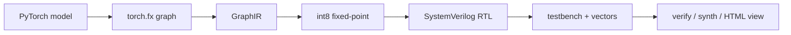

# torch2rtl


`torch2rtl` превращает маленькие PyTorch-модели в понятный fixed-point
SystemVerilog. Не в стиле "нажали кнопку и получили магию", а честно: модель
разбирается через `torch.fx`, переводится во внутренний IR, квантуется, затем
генерируются RTL, testbench, проверочные векторы и визуализация схемы.



Если коротко: пишете небольшую нейросеть на PyTorch, запускаете компиляцию и
получаете папку с `top.sv`, модулями слоев, тестбенчем, `.mem`-файлами,
`report.json` и интерактивной HTML-схемой.

## Зачем это нужно

- Быстро показать путь от PyTorch до RTL без тяжелой инфраструктуры.
- Пощупать fixed-point квантизацию на простых моделях.
- Получить читаемый SystemVerilog, который можно открыть и понять глазами.
- Проверить RTL через Icarus Verilog или Verilator, если они установлены.
- Получить базовый synthesis/stat report через Yosys, если он установлен.

Это учебно-исследовательский компиляторный flow, а не промышленный HLS-комбайн.
Сила проекта в том, что все артефакты маленькие, прозрачные и проверяемые.

## Что уже умеет

Поддерживается MVP `v0.2 Semantic Correctness`. Точный контракт форм, FX-графа,
выхода и fixed-point арифметики описан в
[`docs/v0.2_semantic_correctness.md`](docs/v0.2_semantic_correctness.md).

| Возможность | Статус |
| --- | --- |
| `torch.nn.Linear` для вектора `(in_features,)` | есть |
| `torch.nn.ReLU` | есть |
| полное `torch.nn.Flatten` в один вектор | есть |
| `torch.nn.Conv2d` для статического unbatched входа `(C, H, W)` | есть |
| финальный глобальный `argmax(dim=None, keepdim=False)` | есть |
| signed int8 fixed-point по умолчанию | есть |
| combinational SystemVerilog backend | есть |
| Python fixed-point reference | есть |
| пользовательские quantized verification-векторы с provenance | есть |
| RTL simulation через Icarus Verilog / Verilator | опционально |
| Yosys synthesis/stat pass | опционально |
| интерактивная HTML-визуализация схемы | есть |

Float frontend сохраняет dtype модели: поддержаны `torch.float32` и
`torch.float64`. Параметры других floating/complex dtype, смешанные dtype,
module/global hooks, custom metaclass и переопределённая семантика стандартных
модулей, call path любого вложенного модуля, class-level/external Python state,
custom copy/decorator/introspection path, nested code и состояние, изменяемое во
время trace, отклоняются до FX lowering. После lowering контрольный forward точно
сверяется с GraphIR на нулевом и детерминированном ненулевом входах. Custom
Python conditional/loop/exception control flow и Proxy-dependent formatting
отклоняются до trace. Float reference использует PyTorch kernels, чтобы не
менять класс около float32 cancellation/tie.

Параметры и buffers должны быть обычными CPU tensors с layout `strided`,
contiguous storage, точным типом `Parameter`/`Tensor` и обычными string-именами в
registries; tensor subclasses, negative/conjugate view bits, сохранённый `.grad`,
произвольное tensor/ndarray instance-state и monkeypatch используемых PyTorch API
не входят в контракт.

Статическая input shape задаётся конечным `Sequence`: ранг ≤ 64, размеры —
положительные built-in `int`, всего ≤ 1 000 000 элементов. Тот же лимит действует
для output `Conv2d`; его kernel/stride/padding и координатная арифметика должны
помещаться в signed 32-bit SystemVerilog `int`.

Пример модели, которая хорошо ложится в текущий flow:

```python
import torch
import torch.nn as nn


class TinyMLP(nn.Module):
    def __init__(self) -> None:
        super().__init__()
        self.net = nn.Sequential(
            nn.Linear(16, 32),
            nn.ReLU(),
            nn.Linear(32, 4),
        )

    def forward(self, x: torch.Tensor) -> torch.Tensor:
        return self.net(x)
```

## Честные ограничения

`torch2rtl` пока не пытается компилировать любой PyTorch-код. Сейчас вне зоны
поддержки:

- динамический control flow;
- неизвестные формы тензоров;
- input rank > 64 или input/Conv2d output > 1 000 000 элементов;
- batch/prefix dimensions для `Linear` и batch для `Conv2d`;
- ветвления, skip-connections, несколько входов/выходов и произвольный FX DAG;
- частичный `Flatten` и параметризованный `argmax(dim=...)`;
- module/global hooks, subclasses, custom metaclasses и instance-level
  `forward`/call overrides;
- custom attribute/call/copy descriptors, decorated `forward`, переопределённые
  `named_*`/module-introspection API, nested code objects, class-level или внешнее
  изменяемое Python state и мутация состояния модели во время FX trace/semantic
  probe;
- `ReLU(inplace=True)` и другие немоделируемые побочные эффекты;
- dtype параметров/buffers кроме однородного `float32` или `float64`;
- non-CPU, non-strided, non-contiguous tensors, tensor subclasses,
  negative/conjugate views, сохранённый `.grad`, неточные registry names и прямое
  tensor/ndarray-состояние модуля вне стандартных registries;
- training graph, autograd и GPU-логика;
- grouped/depthwise convolution, dilation;
- Conv2d structural/index values вне signed 32-bit SystemVerilog `int`;
- normalization, attention и большие современные архитектуры;
- production timing closure.

Если модель содержит неподдерживаемый FX-узел, проект падает явно через
`UnsupportedOpError` и показывает, на какой операции остановился.

## Установка

Для v0.2 поддерживается только Python `>=3.12,<3.13`. Python 3.11 и 3.13 в
release-контракт не входят. Самый удобный путь - через `uv`:

```bash
uv --cache-dir temp/uv-cache sync --dev
```

Почему указан `--cache-dir`: на Windows и в ограниченных окружениях стандартный
кеш `uv` иногда лежит вне рабочей папки. Такой вариант проще воспроизводить.
Собранный wheel включает модели встроенных demo, поэтому установленная команда
`torch2rtl demo --name tiny-conv` не требует каталога `examples/` из checkout.

## Быстрый старт

Запустить полный board-free demo-flow:

```bash
uv --cache-dir temp/uv-cache run torch2rtl demo --name tiny-conv --out build/demo
```

Команда сама выполнит компиляцию RTL, симуляцию, Yosys synthesis/stat pass и
обновит `build/demo/visualization.html`. Этот HTML-файл теперь является главным
отчетом демо: в нем есть статус сборки, схема RTL-блоков, trace одного
проверочного вектора, краткие ресурсы синтеза и ссылки на сгенерированные
артефакты.

Доступные демо:

```text
tiny-mlp
grid-classifier
tiny-conv
image-cnn
```

Скомпилировать готовый MLP-пример:

```bash
uv --cache-dir temp/uv-cache run torch2rtl compile examples/tiny_mlp/model.py --input-shape 16 --bits 8 --frac-bits 6 --out build
```

После запуска в `build/` появятся:

```text
top.sv
conv2d_comb.sv
linear_comb.sv
relu.sv
argmax.sv
tb_top.sv
input_vectors.txt
expected_classes.txt
expected_logits.txt
*_weights.mem
*_bias.mem
report.json
visualization.json
visualization.html
```

Откройте `build/visualization.html`, чтобы увидеть схему как интерактивную
микросхему: слои, сигналы, файлы памяти, статус EDA-инструментов и fixed-point
reference для тестового вектора.

Перерисовать визуализацию после `verify` или `synth`:

```bash
uv --cache-dir temp/uv-cache run torch2rtl visualize build --vector-index 0
```

## Проверка RTL

```bash
uv --cache-dir temp/uv-cache run torch2rtl verify build
```

Команда ищет доступный симулятор. Если есть `iverilog` + `vvp`, запускается
сгенерированный testbench. Если Icarus Verilog нет, но есть `verilator`, будет
попытка запуска через Verilator. Явная команда `verify` возвращает ненулевой код,
если симулятор не найден. Только объединённая команда `demo` может явно показать
этот необязательный этап как `skipped`.

Перед `verify` и `synth` проверяются структура `report.json`, обязательная
contract metadata, канонический testbench и локальные SHA-256 generated RTL.
Одиночное несогласованное повреждение проверяемого RTL/testbench/vector/report
контракта приводит к failure до EDA либо к bit-exact failure симуляции. SHA-256
гарантированно связывает только RTL sources; проверки vectors охватывают их
структуру, диапазоны и соответствие ожидаемым результатам, а report —
обязательную metadata. Произвольное допустимое изменение vector payload, не
меняющее результат, или несвязанного report-поля обнаруживать не гарантируется.
Manifest находится в том же build directory и не является внешним корнем
доверия: согласованная злонамеренная замена RTL, vectors, report и их хешей
одновременно находится вне threat model. Для такой защиты нужна внешняя подпись,
доверенный manifest либо полная регенерация из доверенных исходников.

## Synthesis report

```bash
uv --cache-dir temp/uv-cache run torch2rtl synth build
```

Если установлен `yosys`, команда делает простой synthesis/stat pass и пишет
`build/yosys.log`. Если `yosys` не найден, явная команда `synth` сообщает об
этом и возвращает ненулевой код; `demo` может оставить этап опциональным.

## Готовые примеры

### Tiny MLP

Классифицирует вектор из 16 чисел: выбирает блок из 4 элементов с самой большой
суммой.

```bash
uv --cache-dir temp/uv-cache run python examples/tiny_mlp/train.py --epochs 30
uv --cache-dir temp/uv-cache run python examples/tiny_mlp/compile.py \
  --checkpoint examples/tiny_mlp/tiny_mlp.pt --out build
```

### Grid Classifier

Compile-only пример для сетки `4x4`:

```text
Flatten(4x4) -> Linear(16, 8) -> ReLU -> Linear(8, 8)
-> ReLU -> Linear(8, 4) -> derived RTL class_id
```

```bash
uv --cache-dir temp/uv-cache run python examples/grid_classifier/compile.py --out build/grid_classifier
```

Или напрямую через CLI:

```bash
uv --cache-dir temp/uv-cache run torch2rtl compile examples/grid_classifier/model.py --input-shape 4 4 --out build/grid_classifier
```

### Tiny Conv

Мини-пайплайн для проверки `Conv2d`:

```text
Conv2d(1x3x3 -> 1x2x2) -> ReLU -> Flatten -> Linear(4, 4)
```

```bash
uv --cache-dir temp/uv-cache run python examples/tiny_conv/compile.py --out build/tiny_conv
```

Или через CLI:

```bash
uv --cache-dir temp/uv-cache run torch2rtl compile examples/tiny_conv/model.py --input-shape 1 3 3 --out build/tiny_conv
```

### Image CNN Demo

End-to-end демо: обучает маленькую CNN на детерминированных синтетических
изображениях `4x4`, сохраняет checkpoint и компилирует веса в RTL.

```text
Conv2d(1 -> 4) -> ReLU -> Flatten -> Linear(64, 4)
```

```bash
uv --cache-dir temp/uv-cache run python examples/image_cnn/train.py
uv --cache-dir temp/uv-cache run python examples/image_cnn/compile.py
uv --cache-dir temp/uv-cache run torch2rtl verify build/image_cnn/rtl
uv --cache-dir temp/uv-cache run torch2rtl synth build/image_cnn/rtl
```

Артефакты появятся в `build/image_cnn/`:

- `image_cnn.pt`
- `training_report.json`
- `rtl/top.sv`
- `rtl/tb_top.sv`
- `rtl/report.json`
- `rtl/visualization.html`

### Iris MLP

Воспроизводимый пример на bundled Iris dataset: stratified split `90/30/30`,
train-only min-max normalization, обучение `Linear(4, 8) -> ReLU -> Linear(8, 3)`,
checkpoint reload, GraphIR, Q8.4, 30 настоящих test inputs, RTL simulation и
generic Yosys synthesis/stat.

```bash
uv --cache-dir temp/uv-cache sync --dev --extra iris --frozen
uv --cache-dir temp/uv-cache run --frozen --extra iris python examples/iris_mlp/train.py
uv --cache-dir temp/uv-cache run --frozen --extra iris python examples/iris_mlp/compile.py
uv --cache-dir temp/uv-cache run --frozen torch2rtl verify build/iris_mlp/rtl_q8_4
uv --cache-dir temp/uv-cache run --frozen torch2rtl synth build/iris_mlp/rtl_q8_4
```

Полный контракт, ожидаемые результаты и ограничения описаны в
[`examples/iris_mlp/README.md`](examples/iris_mlp/README.md).

## CLI-шпаргалка

```bash
# full board-free demo flow
uv --cache-dir temp/uv-cache run torch2rtl demo --name tiny-conv --out build/demo

# compile
uv --cache-dir temp/uv-cache run torch2rtl compile MODEL.py --input-shape 16 --out build

# verify generated RTL
uv --cache-dir temp/uv-cache run torch2rtl verify build

# run optional Yosys report
uv --cache-dir temp/uv-cache run torch2rtl synth build

# rebuild visualization
uv --cache-dir temp/uv-cache run torch2rtl visualize build --vector-index 0
```

Полезные флаги `compile`:

| Флаг | Что делает |
| --- | --- |
| `--input-shape` | форма входа без batch dimension |
| `--bits` | signed data width, `2..32`, по умолчанию `8` |
| `--frac-bits` | дробная ширина, `0 <= frac_bits < bits`, по умолчанию `6` |
| `--acc-bits` | аккумулятор, `bits < acc_bits <= 64`, по умолчанию `32` |
| `--vectors` | положительное число тестовых векторов |
| `--seed` | seed для воспроизводимых векторов |
| `--out` | папка для RTL и отчетов |

## Архитектура проекта

```text
torch2rtl/
  frontend/pytorch_fx.py        # PyTorch -> torch.fx -> GraphIR
  ir/                           # dataclass-IR для tensors, ops и graph
  quant/fixed_point.py          # fixed-point config и saturation helpers
  quant/reference.py            # fixed reference + dtype-faithful PyTorch float reference
  backend/systemverilog/        # Jinja2 templates и RTL emitter
  verify/                       # vectors, simulator discovery, compare
  synth/                        # Yosys integration
  visualization/                # HTML/JSON визуализация схемы
examples/
  tiny_mlp/
  grid_classifier/
  tiny_conv/
  image_cnn/
  iris_mlp/
```

Внутренний принцип простой: сначала получить маленький и понятный `GraphIR`,
потом уже генерировать артефакты. Поэтому проект удобно читать, отлаживать и
расширять по одному оператору.

## Разработка

Запустить тесты:

```bash
uv --cache-dir temp/uv-cache run pytest -q
```

Тесты покрывают:

- fixed-point rounding, saturation, границы и достаточность `ACC_BITS`;
- PyTorch FX parsing, реальные зависимости и настоящий `output`;
- PyTorch float против GraphIR float по промежуточным слоям;
- Python fixed-point против RTL bit-exact на directed boundary vectors;
- оба формата Yosys stat, включая `Number of cells: 115`;
- SystemVerilog generation;
- Conv2d lowering;
- примеры из `examples/`;
- visualization artifacts;
- стабильные reference classes.

## Roadmap

### Выполнено: пользовательские verification-векторы

- [x] Добавлена в публичный flow возможность передавать собственные входные
  векторы вместо обязательной генерации случайных данных по `vector_count` и
  `seed`.
- Ожидаемые fixed-point logits и классы должен вычислять сам `torch2rtl` через
  `QuantizedGraph`; пользователь передаёт только входы и их provenance. Это
  сохраняет независимость эталона от RTL и исключает ручную подмену
  `input_vectors.txt`, `expected_logits.txt` и `expected_classes.txt`.
- `vectors.json`, `report.json`, `visualization.json` и testbench должны
  создаваться из одного и того же набора входов за один проход. После генерации
  не должно требоваться ручное обновление отчёта или визуализации.
- Публичный API должен явно проверять форму, количество, целочисленный тип и
  диапазон входов для выбранного fixed-point формата, а также сохранять источник
  данных, например `iris_test_split`.
- Критерий готовности: вызов наподобие
  `emit_systemverilog(..., input_vectors=inputs, vector_source="iris_test_split")`
  сразу создаёт согласованные RTL-артефакты, проходит Icarus/Verilator и имеет
  directed-тест, доказывающий, что симуляция использовала именно переданные
  векторы, а не случайно сгенерированные.

- `v0.1`: Linear / ReLU / Flatten / Argmax.
- `v0.2`: Semantic Correctness и воспроизводимый board-free release gate.
- `v0.3`: проверка accuracy обученной CNN по цепочке float → fixed → RTL.
- `v0.4`: sequential MAC backend.
- `v0.5`: streaming interface / AXI-like interface.

### Отложенные идеи без срока

- [ ] Добавить независимую эталонную реализацию вычислений с фиксированной
  точкой на C++ для операций `Linear`, `Conv2d`, `ReLU`, `Flatten` и `Argmax`.
  Сначала она должна принимать уже квантованные целые входы и веса, точно
  воспроизводить правила накопления, арифметического сдвига, возврата к
  исходному масштабу и ограничения допустимым диапазоном. Затем нужно сверять
  промежуточные тензоры, выходы сети и `class_id` между эталонами на Python и
  C++, а также сгенерированной схемой. Все целочисленные значения должны
  совпадать. Такая реализация даст дополнительную независимую проверку
  корректности и, возможно, ускорит оценку точности на всём наборе данных. Это
  не новый способ генерации схемы для ПЛИС.

## Лицензия

MIT. Делайте крутые эксперименты, проверяйте сгенерированный RTL и не верьте
магии без тестов.
